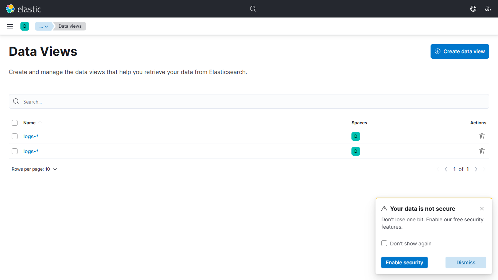
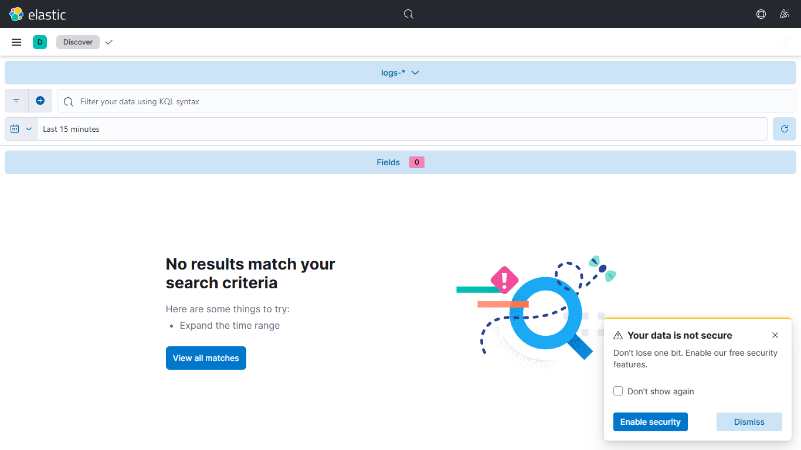

# SIEM-Dashboard-using-ELK-Stack

A complete Docker-based SIEM lab that runs Elasticsearch, Logstash, Kibana, and Filebeat together for log ingestion, parsing, indexing, and dashboard visualization.

## Overview

This repository provides a ready-to-run local environment for building a lightweight security monitoring dashboard. It includes:

- Elasticsearch for log storage and indexing
- Logstash for parsing and routing logs
- Kibana for visualization and dashboard creation
- Filebeat for shipping logs into the pipeline
- Sample authentication logs to validate the flow end to end

## Screenshots





## Quick Start

### Windows (PowerShell)
```powershell
.\quick-start.bat
```

### Linux/macOS
```bash
chmod +x quick-start.sh
./quick-start.sh
```

### Manual Start
```bash
docker compose up -d
```

## Default Access

| Service | URL | Credentials |
|---|---|---|
| Kibana | http://localhost:5601 | elastic / changeme |
| Elasticsearch | http://localhost:9200 | elastic / changeme |
| Logstash Beats | localhost:5044 | N/A |
| Logstash TCP | localhost:5000 | N/A |

## Project Structure

```text
.
├── docker-compose.yml
├── quick-start.sh
├── quick-start.bat
├── README.md
├── SIEM-ELK-STACK-COMPLETE-GUIDE.md
├── elasticsearch/
├── logstash/
├── kibana/
├── filebeat/
└── sample-logs/
```

## Useful Commands

```bash
docker compose ps
docker compose logs -f
docker compose down
docker compose restart logstash
```

## Verification

Test Elasticsearch:
```bash
curl -u elastic:changeme http://localhost:9200/
```

Test Kibana:
```bash
curl http://localhost:5601/api/status
```

Send sample logs:
```bash
cat sample-logs/auth.log | nc localhost 5000
```

## 🔍 Troubleshooting Quick Fixes

| Problem | Solution |
|---------|----------|
| **Can't connect to Elasticsearch** | `docker-compose logs elasticsearch` |
| **Kibana shows error** | Restart Kibana: `docker-compose restart kibana` |
| **Logstash not processing logs** | Check pipeline: `docker-compose logs logstash` |
| **Out of disk space** | Delete old indices: `curl -X DELETE 'http://localhost:9200/logs-2024.07.01'` |
| **High memory usage** | Reduce heap in `docker-compose.yml` |
| **No logs appearing** | Verify Filebeat is running and connected |

---

## 📚 Full Documentation

For comprehensive step-by-step instructions, see:
**[SIEM-ELK-STACK-COMPLETE-GUIDE.md](SIEM-ELK-STACK-COMPLETE-GUIDE.md)**

This guide includes:
- ✅ Detailed installation instructions
- ✅ Configuration explanations
- ✅ Dashboard creation tutorials
- ✅ Alerting setup guide
- ✅ Security best practices
- ✅ Troubleshooting solutions
- ✅ Learning resources

---

## 🔐 Security Reminders

- **⚠️ Default credentials:** Use only for development/testing
- **⚠️ Disable security:** Currently disabled for easy setup
- **⚠️ For Production:** Enable X-Pack security, set strong passwords, use TLS

### **Enable Security (Production):**
```yaml
# In docker-compose.yml
- xpack.security.enabled=true
- ELASTIC_PASSWORD=your-strong-password
```

---

## 📞 Getting Help

1. **Check Logs:** `docker-compose logs -f`
2. **Read Full Guide:** See SIEM-ELK-STACK-COMPLETE-GUIDE.md
3. **Official Docs:** https://www.elastic.co/guide/
4. **Community:** https://discuss.elastic.co/

---

## 📊 Example Dashboards to Create

- ✅ Failed Login Attempts (with alerts)
- ✅ SSH Activity Timeline
- ✅ Top Source IPs
- ✅ Failed Logins by User
- ✅ System Resource Usage
- ✅ Security Events Summary
- ✅ User Activity Timeline

---

## 🎯 Next Steps

1. ✅ Run `./quick-start.sh` or `quick-start.bat`
2. ✅ Open Kibana at http://localhost:5601
3. ✅ Create index pattern for `logs-*`
4. ✅ Send sample logs or setup Filebeat
5. ✅ Create first visualization
6. ✅ Build security dashboard
7. ✅ Setup alerts for critical events
8. ✅ Monitor and refine rules

---

## 📝 Notes

- All data is stored in `elasticsearch/data/` directory
- To reset everything, delete the data folder and restart
- Configuration changes may require service restart
- Elasticsearch requires sufficient disk space for indexing
- Keep all versions synchronized (8.11.0)

---

**Last Updated:** July 2024
**ELK Stack Version:** 8.11.0
**Status:** Ready for Deployment ✅
